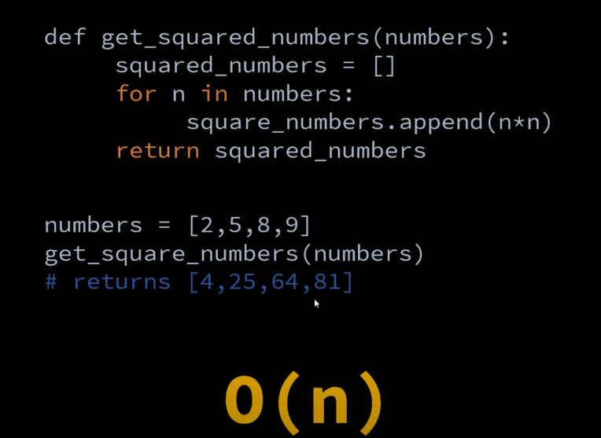
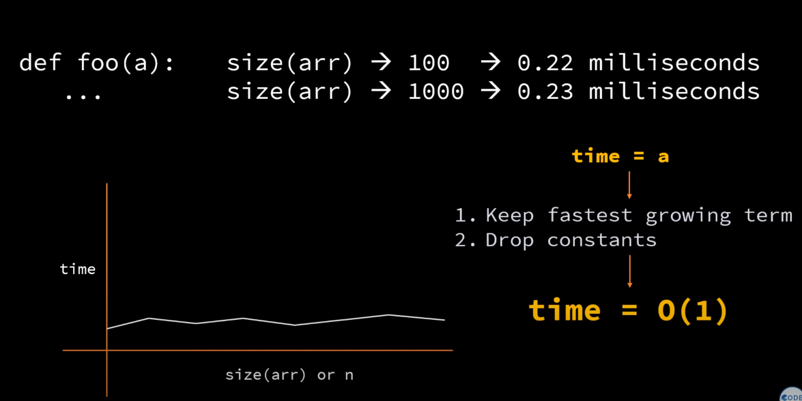
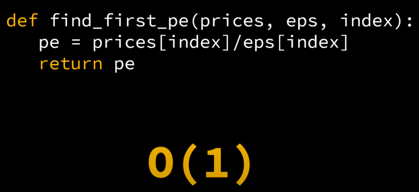
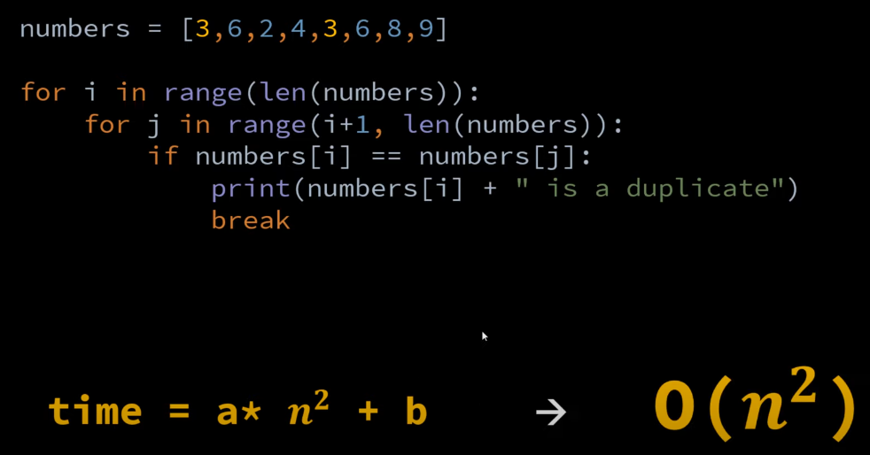
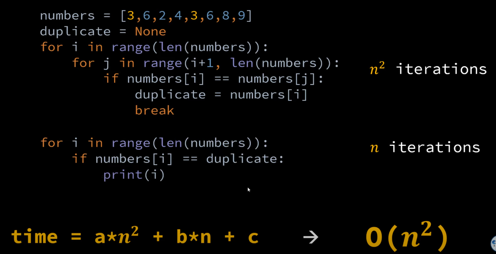
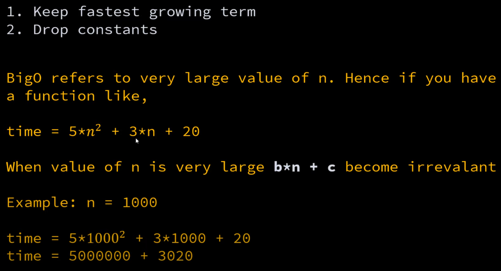
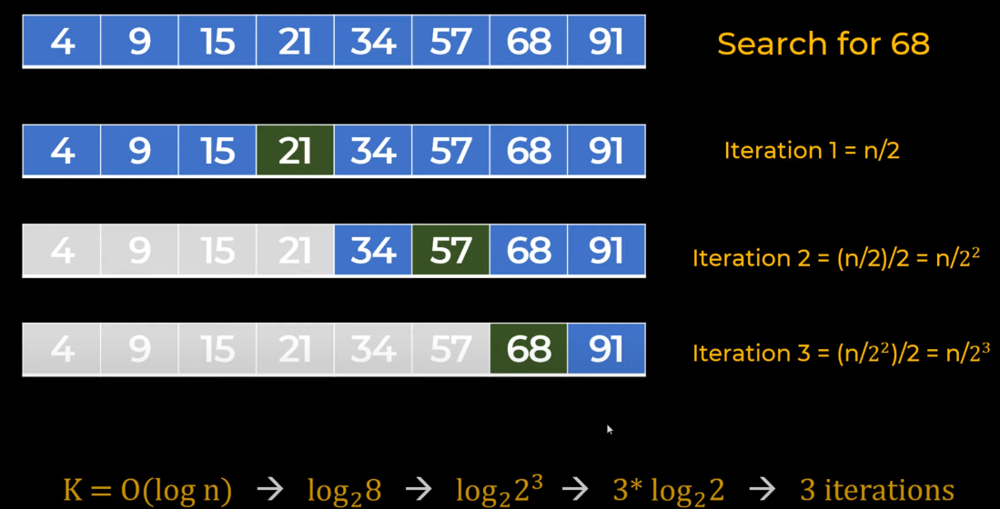
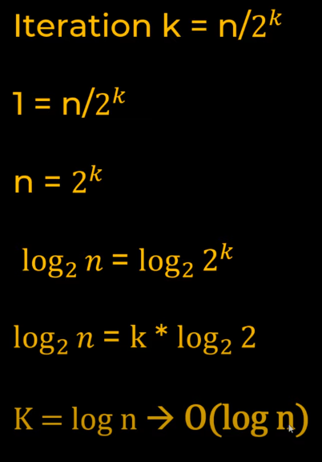

<h1> Running Time: </h1>
time = a*n + b
1. keep the fastest growing term and drop rest. (dropping b)
2. Drop the constant (a)
So, time = O(n)

 If the time is constant then t = a. Doesnt matter the array size,

Below, the time= O(1) because the time taken to calculate will always be constant as we are doing calculation on a particular index.

Below the complexity is O(n^2) because generally a calculation with two for loops is O(n^2).
time = a * n^2 + b
Rule 1: Keep the fastest growing term i.e. is n
Rule 2: Drop constant i.e. a, hence O(n^2)

Below the complexity is O(n^2) because, as mentioned above whenever there is two loops, the complexity is mostly n^2.
But here we have another loop as well but since the rule is that we just have to keep the fastest growing number and
here if the value of n is in millions then b*n won't have much impact in the value, so we drop that as well along with b.

Linear search complexity : O(n)
Because it will iterate to all the elements in the array.
 

Binary search complexity : O(log n) . Because here we have a sorted array and we are not iterating each and every element , we have started from the middle element and the search space is halfed.

