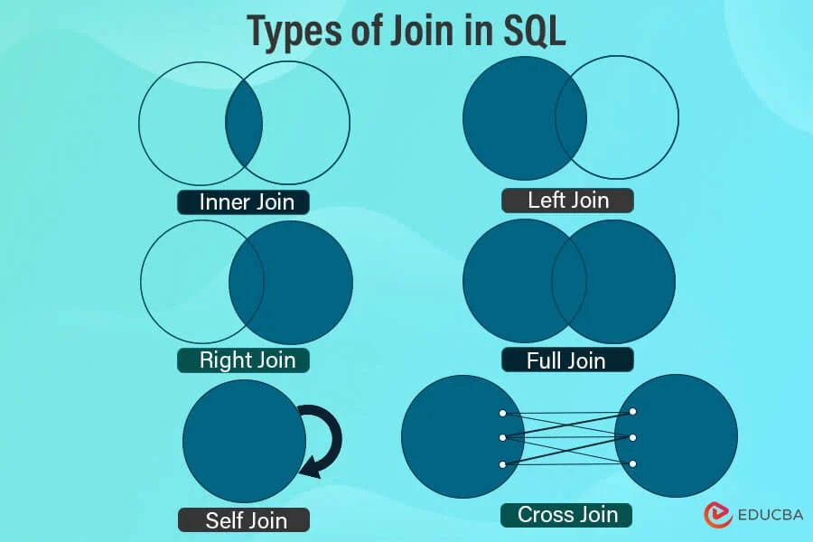

<h1>Inner Join </h1>

In an inner join, we only select the common data in both tables.
To make it more precise, all the records from both the tables matching up the
condition mentioned with the join are picked in this join.

<code>
SELECT column-names FROM tableA INNER JOIN tableB
ON column-name1 = column-name2 WHERE condition
</code>

<h1>Left Join </h1>

In the left join, we select all the data from the left table, and from the 
right table, we only select the data set that matches up with the condition 
mentioned with the join.

<code>
SELECT column-names FROM tableA LEFT JOIN tableB ON 
column-name1 = column-name2 WHERE condition

</code>
